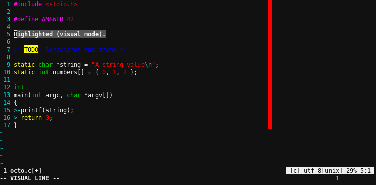

# Octochrome

## An 8-colour scheme for use in 256-colour vim.

Forces vim to obey 8-colour terminal colours while in 256-colour mode without
preventing plugins (such as [Powerline]) from being full 256-colour.  Vim will
use the colours the user has configured for their own terminal.  Perfect for
users that want a uniform look across the terminal without losing the extra
colours.

This colorscheme is not intended to be an implementation of vim's default
8-colour scheme.  Instead, the intent is to make code as colourful and clear as
possble.

### Installation

#### With Vundle/NeoBundle/ETC.

Place the following line in `~/.vimrc`:

    Bundle 'victorialacroix/vim-octochrome'

Then, run:

    :PluginInstall

And add the following line to your .vimrc to enable octochrome:

    colorscheme octochrome

#### Manual

Download `octochrome.vim` and place it in the directory `~/.vim/colors/`
(creating it if necessary).  Then, add the following line to your .vimrc

    colorscheme octochrome

### Copying

The file `octochrome.vim` is provided under the terms of the MIT license.  See
LICENSE for the full text.

# Zerochrome

Zerochrome is an additional 0-colour (black and white only) scheme, with
different settings from vim's default 0-colour mode.  To use, substitute
`zerochrome` for `octochrome` in the above instructions.

[Powerline]: https://github.com/powerline/powerline/ "Powerline"
